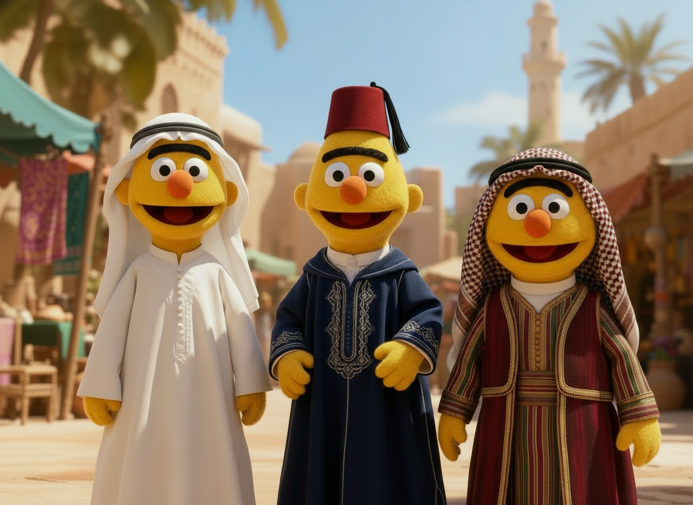

# From FusHa to Folk: Exploring Cross-Lingual Transfer in Arabic Language Models

This repository contains experiments and analysis tools for studying cross-lingual transfer learning across Arabic pre-trained language models. The project focuses on evaluating how well models trained on Modern Standard Arabic (MSA) and specific Arabic dialects transfer across each other through probing tasks and Centered Kernel Alignment (CKA) analysis.



## 🔍 Overview

Arabic is a morphologically rich language with significant dialectal variations across different regions. This project investigates:

1. **Cross-dialectal transfer capabilities** of Arabic BERT models
2. **Representational similarity** between models using CKA analysis
3. **Performance evaluation** on downstream tasks (NER, POS tagging, Sentiment Analysis)

## 📊 Supported Arabic Dialects

- **Saudi Arabian Arabic** 🇸🇦
- **Egyptian Arabic** 🇪🇬  
- **Moroccan Arabic** 🇲🇦
- **Algerian Arabic** 🇩🇿
- **Lebanese Arabic** 🇱🇧
- **Jordanian Arabic** 🇯🇴
- **Omani Arabic** 🇴🇲
- **Modern Standard Arabic (MSA)**

## 🤖 Supported Models

The project evaluates various Arabic language models:

| Model | Dialect Focus | Source |
|-------|---------------|--------|
| CAMeL-Lab/bert-base-arabic-camelbert-msa | MSA | [Hugging Face](https://huggingface.co/CAMeL-Lab/bert-base-arabic-camelbert-msa) |
| CAMeL-Lab/bert-base-arabic-camelbert-mix | Mixed Dialects | [Hugging Face](https://huggingface.co/CAMeL-Lab/bert-base-arabic-camelbert-mix) |
| CAMeL-Lab/bert-base-arabic-camelbert-da | Dialectal Arabic | [Hugging Face](https://huggingface.co/CAMeL-Lab/bert-base-arabic-camelbert-da) |
| faisalq/SaudiBERT | Saudi Arabic | [Hugging Face](https://huggingface.co/faisalq/SaudiBERT) |
| faisalq/EgyBERT | Egyptian Arabic | [Hugging Face](https://huggingface.co/faisalq/EgyBERT) |
| SI2M-Lab/DarijaBERT | Moroccan Arabic | [Hugging Face](https://huggingface.co/SI2M-Lab/DarijaBERT) |
| alger-ia/dziribert | Algerian Arabic | [Hugging Face](https://huggingface.co/alger-ia/dziribert) |
| reemalyami/AraRoBERTa-* | Various Dialects | [Hugging Face](https://huggingface.co/reemalyami) |

## 🗂️ Project Structure

```
├── README.md
├── requirements.txt          # Python dependencies
├── models.json               # Model configurations for probing
├── run_probing_experiment.py # Main probing experiment runner
├── run_cka_experiment.py     # Main CKA experiment runner
├── 
├── data/                    # Raw datasets
├── dataset_probing_dialects.ipynb  # Jupyter notebook for cleaning Probing datasets
├── dataset_cka.ipynb        # Jupyter notebook for cleaning CKA datasets
├── data_cleaned/            # Preprocessed datasets
│   ├── CKA/MADAR_Corpus/    # MADAR corpus for CKA analysis
│   └── Probing/             # Datasets for probing tasks
│       ├── NER/             # Named Entity Recognition
│       ├── POS/             # Part-of-Speech tagging  
│       └── Sentiment/       # Sentiment analysis
├── results/
│   ├── results_dialects/        # Probing experiment results (MSA datasets)
│   ├── results_dialects_balanced/ # Balanced probing results (Dialectal datasets)
│   ├── results_cka/            # CKA analysis results
│   └── non_normalized_best_layer_score_dialects.csv # Non-normalized scores of experiments on Dialectal Datasets (Figure 5 in paper)
├── 
├── src/                    # Source code
│   ├── cka.py             # CKA implementation
│   ├── Probe.py           # Probing experiment logic
│   ├── encoding/          # Model encoding utilities
│   ├── interpretation/    # Analysis and interpretation tools
│   └── utils/            # Helper utilities
├──
├── visualizations/        # Generated plots and figures
├── visualizations.ipynb   # Jupyter notebook for analysis and visualization of results
├── save_non_normalized_scores.py  # Save Non-normalized results of experiments on Dialectal Datasets (Figure 5 in paper)
```

## 🚀 Quick Start

### 1. Installation

```bash
# Clone the repository
git clone https://github.com/cross_lingual_transfer_arabic.git
cd cross_lingual_transfer_arabic

# Install dependencies
pip install -r requirements.txt
```

### 2. Run Probing Experiments

```bash
# Run experiments on MSA datasets
python run_probing_experiment.py --experiment-type MSA --results-dir "results/results_msa"

# Run experiments on Dialectal datasets with balanced datasets and skipping irrelevant models for dataset
python run_probing_experiment.py --experiment-type Dialect --results-dir "results/results_dialects_balanced"

# Run the following command to save the non-normalized scores of experiments on Dialectal Datasets
# Note: Run it only after previous command is completed and all the results are stored 
python save_non_normalized_scores.py --results-dir "results/results_dialects_balanced"
```

### 3. Run CKA Analysis

```bash
# Run CKA analysis for all scenarios
python run_cka_experiment.py --results-dir "results/results_cka"
```

### Command Line Arguments

**Probing Experiments:**
- `--models-file`: Model configuration file
- `--data-dir`: Input data directory
- `--results-dir`: Output results directory
- `--task`: Specific task (NER/POS/Sentiment)
- `--dialect`: Target dialect
- `--balanced`: Use balanced datasets
- `--skip-irrelevant`: Skip irrelevant models

**CKA Experiments:**
- `--models-file`: Dialect model configurations
- `--msa-model`: Reference MSA model
- `--corpus-dir`: MADAR corpus directory
- `--scenario`: Analysis scenario (1/2/3/all)
- `--pooling`: Sentence pooling strategy

## 📋 Experiment Types

### Probing Experiments

Evaluate model performance on downstream tasks:

- **Named Entity Recognition (NER)**: Identify and classify named entities
- **Part-of-Speech (POS) Tagging**: Assign grammatical categories
- **Sentiment Analysis**: Classify text sentiment

### CKA (Centered Kernel Alignment) Analysis

Measure representational similarity between models:

**Three Scenarios:**
1. **Both on Dialect**: Both models process dialectal text
2. **Both on MSA**: Both models process MSA text  
3. **Cross Corpus**: MSA model on MSA text, Dialetal model on dialectal text

## 📊 Datasets

### MADAR Corpus
- Multi-Arabic Dialect Applications and Resources
- Parallel sentences across 25+ Arabic cities
- Used for CKA analysis

### Probing Datasets
- **NER**: ACDNER, DarNERcorp, Wojood, CLEANANERcorp, DzNER, MADAR (Tagged)
- **POS**: CAMeL Treebank, QCRI Arabic POS Dialect, NArabizi, Shami, GUMAR
- **Sentiment**: LABR, L-HSAB, MARSA, DZYT, MYC, AET, JHSC


## Models (`models.json`)
```json
{
    "CAMeL-Lab/bert-base-arabic-camelbert-msa": {"dialect": "MSA"},
    "faisalq/SaudiBERT": {"dialect": "Saudi"},
    "SI2M-Lab/DarijaBERT": {"dialect": "Morocco"}
}
```

## 📈 Results and Analysis

Results are saved in JSON format and include:

### Probing Results
- Model performance metrics
- Cross-dialectal transfer scores

### CKA Results
- Layer-wise similarity matrices
- Cross-dialectal representational alignment

### Jupyter Notebooks
- `dataset_cka.ipynb`: CKA dataset preparation
- `dataset_probing_dialects.ipynb`: Probing dataset preparation
- `visualizations.ipynb`: Result visualization


## 📝 Citation

If you use this in your research, please cite:

```bibtex
@misc{khalak2026fushafolkexploringcrosslingual,
      title={From FusHa to Folk: Exploring Cross-Lingual Transfer in Arabic Language Models}, 
      author={Abdulmuizz Khalak and Abderrahmane Issam and Gerasimos Spanakis},
      year={2026},
      eprint={2602.09826},
      archivePrefix={arXiv},
      primaryClass={cs.CL},
      url={https://arxiv.org/abs/2602.09826}, 
}
```

---

**Keywords**: Arabic NLP, Cross-lingual Transfer Learning, Dialectal Arabic, BERT, Probing Tasks, CKA Analysis, Named Entity Recognition, Part-of-Speech Tagging, Sentiment Analysis
